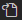

# IDEKeymaps

I want my keymaps to be synchronized between the different IDE I use  

## Import keymaps

#### PyCharm

1. File > Manage IDE Settings > Import Settings  
1. Select file ./PyCharm/pycharm_settings.zip  

#### VSCode

1. Open file ./VSCode/keybindings.json and copy its content
1. File > Preferences > Keyboard shortcuts
1. Open Keyboard Shortcut as JSON by clicking on the  icon in top right corner
1. Paste the json content here
