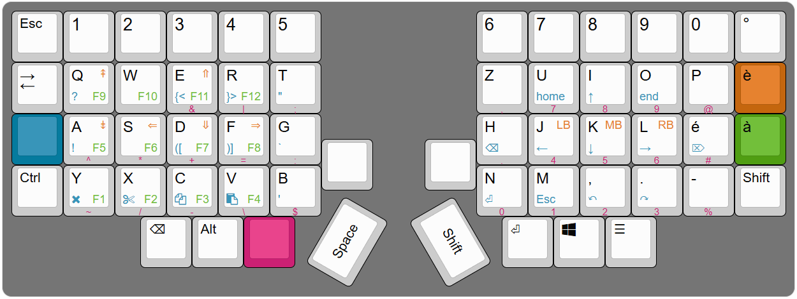

# Keymaps 




The visualization has been created with [Keyboard Layout Editor](https://www.keyboard-layout-editor.com/#/)


```
[{fa:[4]},"Esc",{fa:[6]},"1","2","3","4","5",{x:3},"6","7","8","9","0","°"],
[{fa:[5,0,0,0,0,0,5]},"→\n\n\n\n\n\n←",{t:"#000000\n#057b9e\n#c4660e\n#509e13\n#cc2174"},"Q\n?\n⇞\nF9","W\n\n\nF10","E\n{<\n⇑\nF11\n&","R\n}>\n\nF12\n|","T\n\"\n\n\n;",{x:3},"Z\n\n\n\n,","U\nhome\n\n\n7","I\n↑\n\n\n8","O\nend\n\n\n9","P\n\n\n\n@",{c:"#c4660e"},"è"],
[{c:"#057b9e",a:7},"",{c:"#cccccc",a:4},"A\n!\n⇟\nF5\n^","S\n\n⇐\nF6\n*","D\n([\n⇓\nF7\n+","F\n)]\n⇒\nF8\n=","G\n`\n\n\n:",{x:3},"H\n⌫\n\n\n.","J\n←\nLB\n\n4","K\n↓\nMB\n\n5","L\n→\nRB\n\n6","é\n⌦\n\n\n#",{c:"#509e13"},"à"],
[{y:-0.5,x:6,c:"#cccccc",a:7},"",{x:1},""],
[{y:-0.5,a:4,fa:[4]},"Ctrl",{fa:[5]},"Y\n\n\nF1\n~","X\n\n\nF2\n/","C\n\n\nF3\n-","V\n\n\nF4\n\\","B\n'\n\n\n$",{x:3},"N\n⏎\n\n\n0","M\nEsc\n\n\n1",",\n↶\n\n\n2",".\n↷\n\n\n3","-\n\n\n\n%",{fa:[4]},"Shift"],
[{x:2.5,f:4},"⌫","Alt",{c:"#cc2174",a:7},"",{x:4,c:"#cccccc",a:4},"⏎","Win","☰"],
[{r:60,rx:8.5,ry:4.5,y:-0.5,x:-0.75,a:7,w:1.5},"Shift"],
[{r:-60,rx:6.5,y:-0.5,x:-0.75,w:1.5},"Space"]
```
The code above is for visualization purposes only, it has not been generated by the project and is not part of the project itself.  
Next time do it on [thockfactory](https://thockfactory.com/ch/configurator)